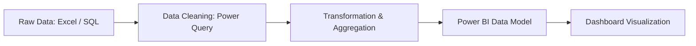

# 🚀 Carrier Dashboard – Logistics & Billing Analytics
## 📌 Overview

The Carrier Dashboard is an end-to-end data analytics project built to monitor and analyze logistics operations, billing status, and vendor performance.
It provides actionable insights into:

📦 Bill processing  
⏳ Pending workflows  
🚚 Vendor performance  
📊 Branch-level operations  

This project demonstrates real-world data engineering + analytics skills using Power BI, SQL, and data transformation techniques.

## 🎯 Key Business Problems Solved

- Identify pending bills and bottlenecks
- Track APMS uploads vs completed payments
- Monitor vendor-wise performance & delays
- Analyze branch-level billing distribution
- Provide real-time operational visibility

📂 Project Structure

## 📊 Dashboard Features

🔹 1. Billing Overview  
- Total Bills  
- Payment Completed  
- APMS Uploaded  
- Total POD (Proof of Delivery)  

🔹 2. Pending Analysis  
- Pending with Vendor
- Pending with DSC
- Pending with CARL
- Today’s Pending

🔹 3. Vendor Insights  
- Vendor-wise bill distribution  
- Validation status by vendors  
- Top vendors by workload  

🔹 4. User Performance Tracking  
- APMS uploads by user  
- Bill count by user  
- POD handled by users  

🔹 5. Branch-Level Analysis  
- Bill count by branch  
- Regional workload distribution  

## 🛠️ Tech Stack  
🔹 Data Processing  
- SQL (Data extraction & aggregation)  
- Power Query (Data cleaning & transformation)  

🔹 Visualization
- Power BI (Interactive dashboards)  

🔹 Tools
- Git & GitHub  
- Excel (Data source)  

## ⚙️ Data Pipeline

## 📸 Dashboard Preview

🔹 Billing Overview  
- Total Bills: 4803  
- Payment Done: 4503  
- Total POD: 108487  

🔹 Pending Breakdown  
- Vendor Pending: 177  
- DSC Pending: 112  
- CARL Pending: 191  

🔹 Vendor Distribution  
- Major vendors include:  
- BLT Logistics Pvt Ltd  
- Century Cargo Carrier Pvt Ltd  
- Agarwal Packers & Movers  

  

  

  

  

## 📈 Key Insights

📊 Majority of bills are successfully processed (~94%)  
⚠️ Significant delays observed in vendor and DSC stages  
🏢 Certain branches contribute disproportionately to workload  
👨‍💻 User-level performance varies significantly  

## 🚀 How to Use

### Clone the repository
git clone https://github.com/shudant/Carrier_dasboard.git

## 💡 Future Enhancements

☁️ Migrate pipeline to Azure Data Factory (ADF)  
🧊 Store data in Azure Data Lake / SQL Database  
⚡ Build real-time streaming dashboard  
🤖 Add ML model for delay prediction  
🌐 Deploy dashboard via Power BI Service  

## 🧠 Skills Demonstrated

- Data Cleaning & Transformation  
- ETL Pipeline Design  
- Data Modeling  
- Dashboard Design (Power BI)  
- Business Insight Generation  
- SQL Query Optimization  

## 👨‍💻 Author

Suddhant Gautam
